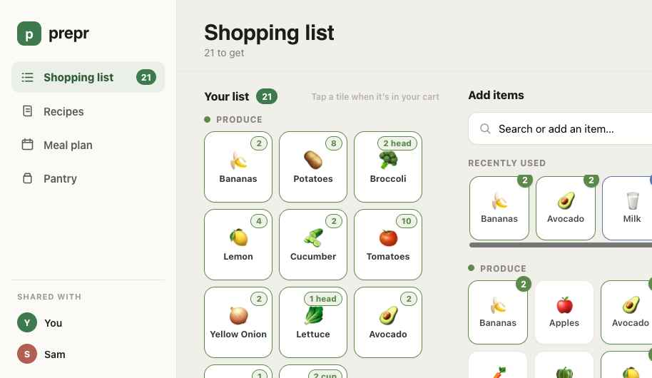

# prepr

> A shared grocery list, recipe box, meal planner and pantry — that works offline.

**prepr** turns the weekly food shuffle into something calm: tap items onto a
shared list, save recipes, plan the week, and keep track of the staples already
in your pantry. It's a fast, installable PWA with all data stored locally on your
device — no account required.

🌐 **Live:** https://prepr.camlc.dev



## Features

- **Shopping list** — categorised, colour-coded tiles. Tap a tile when it's in
  your cart (with one-tap **undo**); tap the quantity pill to edit units, notes
  and amounts. Search the catalog or add any custom item.
- **Recipes** — a recipe box with photos-free emoji banners, searchable by name
  or ingredient. Open a recipe to scale ingredients by serving count, then add
  them to your list in one tap (pantry staples are skipped automatically).
  Create, edit, favourite and delete your own recipes.
- **Meal plan** — a Mon–Sun week grid. Assign recipes to days, then **add the
  whole week to your list** with quantities aggregated across meals.
- **Pantry** — mark the staples you keep on hand so they're skipped when adding
  recipes to your list.
- **Works everywhere** — responsive layout (desktop sidebar / mobile bottom
  nav), **installable PWA** with offline support, **light & dark themes**,
  keyboard shortcuts, and **export / import** of your data as JSON.

## Tech

- [Vite](https://vitejs.dev/) + [React 18](https://react.dev/) + TypeScript
- [vite-plugin-pwa](https://vite-pwa-org.netlify.app/) (Workbox) for offline
- State in a small `useReducer` store with `localStorage` persistence; the core
  logic lives in pure, unit-tested functions (`src/state/operations.ts`)
- Vitest + Testing Library for unit and integration tests

## Develop

```bash
npm install
npm run dev          # start the dev server
npm test             # run the test suite
npm run lint         # eslint
npm run typecheck    # tsc --noEmit
npm run build        # production build into dist/
npm run preview      # preview the production build
```

Icons are generated from a single vector source:

```bash
npm install --no-save sharp && node scripts/gen-icons.mjs
```

## Deployment

The app is a static site deployed to **GitHub Pages** via GitHub Actions
(`.github/workflows/deploy.yml`). On every push to `main` the site is built and
published; `public/CNAME` points it at `prepr.camlc.dev`.

To make the custom domain resolve, add a DNS record for the `prepr` subdomain of
`camlc.dev`:

| Type  | Name    | Value                    |
| ----- | ------- | ------------------------ |
| CNAME | `prepr` | `camclarke11.github.io.` |

Then, in the repo's **Settings → Pages**, confirm the source is **GitHub
Actions** and the custom domain is `prepr.camlc.dev` with **Enforce HTTPS**
enabled. (The workflow enables Pages automatically on first run.)

## License

TBD
